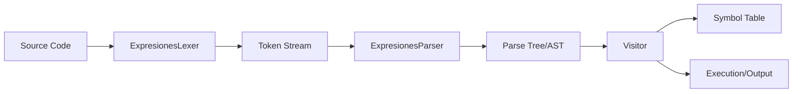

## Compilation Pipeline

The Expresiones compiler follows a traditional multi-stage compilation architecture using ANTLR 4.13.1 for lexical and syntactic analysis. The compilation process flows through four distinct phases:

<Steps>
  <Step title="Lexical Analysis">
    The `ExpresionesLexer` tokenizes source code into 27 token types including keywords, operators, identifiers, and literals.
  </Step>
  
  <Step title="Syntactic Analysis">
    The `ExpresionesParser` constructs an Abstract Syntax Tree (AST) following 7 grammar rules defined in `Expresiones.g`.
  </Step>
  
  <Step title="Semantic Analysis">
    The custom `Visitor` class traverses the AST, performing type checking, variable resolution, and symbol table management.
  </Step>
  
  <Step title="Execution">
    The visitor pattern enables interpretation by evaluating expressions and executing statements during tree traversal.
  </Step>
</Steps>

## Architecture Diagram



## Core Components

### Grammar Definition

The language specification is defined in `Expresiones.g` using ANTLR syntax:

- **Syntactic Rules**: 7 parser rules (root, instrucciones, bloque, declaracion, asignacion, condicion, expr)
- **Lexical Rules**: 27 token types covering keywords, operators, identifiers, and literals
- **Language Features**: Variable declarations, assignments, arithmetic expressions, logical operations, and conditional statements

<Note>
The grammar file `Expresiones.g` is the single source of truth. Changes to the grammar require regenerating the lexer and parser using ANTLR 4.13.1.
</Note>

### Generated Components

<CardGroup cols={2}>
  <Card title="ExpresionesLexer.py" icon="code">
    Auto-generated lexer that converts source text into tokens. Contains 27 token type constants and lexical rules.
  </Card>
  
  <Card title="ExpresionesParser.py" icon="sitemap">
    Auto-generated parser that builds the parse tree from token stream. Implements 7 context classes for AST nodes.
  </Card>
  
  <Card title="ExpresionesVisitor.py" icon="eye">
    Base visitor class with empty implementations for all visit methods. Extended by custom implementations.
  </Card>
  
  <Card title="Visitor.py" icon="user-tie">
    Custom visitor implementation providing semantic analysis, symbol table management, and interpretation.
  </Card>
</CardGroup>

### Data Structures

#### Symbol Table

The compiler maintains a symbol table as a Python dictionary mapping variable names to `Simbolo` objects:

```python
class Simbolo:
    def __init__(self, nombre, tipo, valor=None):
        self.nombre = nombre  # Variable identifier
        self.tipo = tipo      # Type: 'int', 'float', or 'bool'
        self.valor = valor    # Runtime value
```

The symbol table is managed by the `Visitor` class:

```python
class Visitor(ExpresionesVisitor):
    def __init__(self):
        self.tabla_simbolos = {}  # Symbol table
```

## Language Features

### Supported Constructs

<Accordion title="Variable Declarations">
  ```expresiones
  int x = 10;
  float y = 3.14;
  bool flag;
  ```
  Supports `int`, `float`, and `bool` types with optional initialization.
</Accordion>

<Accordion title="Arithmetic Expressions">
  ```expresiones
  int result = (a + b) * c - d / 2;
  ```
  Supports `+`, `-`, `*`, `/` with proper precedence (multiplication/division before addition/subtraction).
</Accordion>

<Accordion title="Conditional Statements">
  ```expresiones
  if (x > 10) {
      y = x * 2;
  } else {
      y = x / 2;
  }
  ```
  Supports relational operators (`>`, `<`, `==`, `!=`, `>=`, `<=`) and logical operators (`&&`, `||`, `!`).
</Accordion>

## Token Types Reference

The lexer recognizes 27 token types defined in `ExpresionesLexer.py`:

| Token | Value | Description |
|-------|-------|-------------|
| `PROGRAMA` | 1 | Keyword `program` |
| `SI` | 2 | Keyword `if` |
| `SINO` | 3 | Keyword `else` |
| `TIPO` | 4 | Data types: `int`, `float`, `bool` |
| `LLAVE_IZQ` | 5 | Left brace `{` |
| `LLAVE_DER` | 6 | Right brace `}` |
| `PAR_IZQ` | 7 | Left parenthesis `(` |
| `PAR_DER` | 8 | Right parenthesis `)` |
| `PUNTO_COMA` | 9 | Semicolon `;` |
| `ASIGNACION` | 10 | Assignment `=` |
| `SUMA` | 11 | Addition `+` |
| `RESTA` | 12 | Subtraction `-` |
| `MULT` | 13 | Multiplication `*` |
| `DIV` | 14 | Division `/` |
| `MAYOR` | 15 | Greater than `>` |
| `MENOR` | 16 | Less than `<` |
| `IGUAL` | 17 | Equality `==` |
| `DIFERENTE` | 18 | Not equal `!=` or `<>` |
| `MAYOR_IGUAL` | 19 | Greater or equal `>=` |
| `MENOR_IGUAL` | 20 | Less or equal `<=` |
| `Y_LOGICO` | 21 | Logical AND `&&` |
| `O_LOGICO` | 22 | Logical OR `||` |
| `NO_LOGICO` | 23 | Logical NOT `!` |
| `ID` | 24 | Identifier pattern |
| `NUMERO` | 25 | Number literal (int or float) |
| `WS` | 26 | Whitespace (skipped) |
| `COMENTARIO` | 27 | Single-line comment (skipped) |

## Parser Rules

The parser implements 7 grammar rules defined in `ExpresionesParser.py`:

- `RULE_root` (0): Program entry point
- `RULE_instrucciones` (1): Instructions (declarations, assignments, conditionals)
- `RULE_bloque` (2): Code blocks
- `RULE_declaracion` (3): Variable declarations
- `RULE_asignacion` (4): Variable assignments
- `RULE_condicion` (5): Conditional expressions
- `RULE_expr` (6): Arithmetic expressions

<Note>
See individual component pages for detailed implementation information:
- [Lexer](/architecture/lexer) - Tokenization process
- [Parser](/architecture/parser) - AST construction
- [Visitor](/architecture/visitor) - Tree traversal and interpretation
- [Symbol Table](/architecture/symbol-table) - Variable management
</Note>