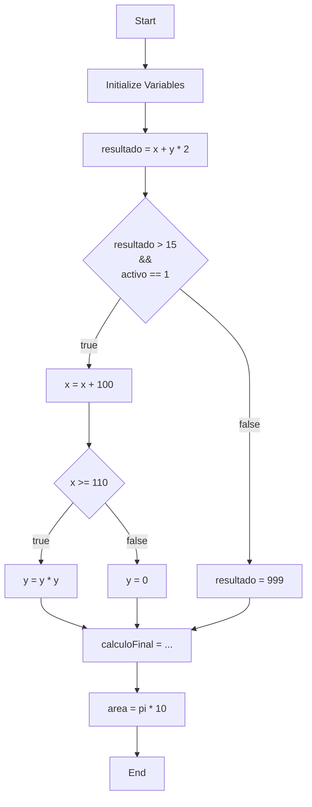

## Overview

This guide showcases a complete Expresiones program that combines arithmetic operations, nested conditionals, logical operators, and multiple data types to demonstrate the full capabilities of the language.

## Complete Example Program

Here's a comprehensive program from `entrada.txt` that demonstrates all major features:

```expresiones
program {
    // 1. Declaraciones e inicializaciones
    int x = 10;
    int y = 5;
    float pi = 3.14;
    bool activo = 1; // En lógica, 1 es True
    int resultado = 0;

    // 2. Aritmética con jerarquía (Multiplicación antes que suma)
    // 10 + 5 * 2 = 20
    resultado = x + y * 2;

    // 3. Condicional con lógica compuesta (AND, OR, NOT)
    if (resultado > 15 && activo == 1) {
        // Bloque verdadero
        x = x + 100;
        
        // 4. Condicional Anidado
        if (x >= 110) {
            y = y * y; // 5 * 5 = 25
        } else {
            y = 0;
        }
    } else {
        // Este bloque no debería ejecutarse
        resultado = 999;
    }

    // 5. Prueba de paréntesis y flotantes
    // (10 + 25) / 5 = 7
    int calculoFinal = (x - 90 + y) / 5;
    
    float area = pi * 10;
}
```

## Program Execution Walkthrough

<Steps>

### Step 1: Variable Initialization

The program begins by declaring and initializing five variables:

```
┌─────────────┬──────────┬───────────┐
│ Identifier  │ Type     │ Value     │
├─────────────┼──────────┼───────────┤
│ x           │ int      │ 10        │
│ y           │ int      │ 5         │
│ pi          │ float    │ 3.14      │
│ activo      │ bool     │ 1 (true)  │
│ resultado   │ int      │ 0         │
└─────────────┴──────────┴───────────┘
```

### Step 2: Arithmetic with Operator Precedence

The expression `resultado = x + y * 2` is evaluated:

**Evaluation order:**
1. `y * 2` → `5 * 2` = `10` (multiplication first)
2. `x + 10` → `10 + 10` = `20` (then addition)
3. `resultado` = `20`

```
resultado = 20
```

### Step 3: Compound Conditional Evaluation

The condition `resultado > 15 && activo == 1` is checked:

**Evaluation:**
- `resultado > 15` → `20 > 15` → **true**
- `activo == 1` → `1 == 1` → **true**
- `true && true` → **true**

The if block will execute.

### Step 4: First If Block Execution

Inside the true branch, `x = x + 100` executes:
- `x = 10 + 100` = `110`

```
x = 110
```

### Step 5: Nested Conditional

A nested condition checks `x >= 110`:
- `110 >= 110` → **true**

The nested if block executes:
- `y = y * y` → `y = 5 * 5` = `25`

```
y = 25
```

### Step 6: Complex Expression with Parentheses

The expression `calculoFinal = (x - 90 + y) / 5` is evaluated:

**Evaluation order:**
1. `x - 90` → `110 - 90` = `20` (parentheses first)
2. `20 + y` → `20 + 25` = `45`
3. `45 / 5` = `9`

```
calculoFinal = 9
```

### Step 7: Float Arithmetic

Finally, `area = pi * 10` is calculated:
- `3.14 * 10` = `31.4`

```
area = 31.4
```

</Steps>

## Final Symbol Table

After complete execution, the symbol table contains:

```
┌──────────────┬──────────┬───────────┐
│ Identifier   │ Type     │ Value     │
├──────────────┼──────────┼───────────┤
│ x            │ int      │ 110       │
│ y            │ int      │ 25        │
│ pi           │ float    │ 3.14      │
│ activo       │ bool     │ 1 (true)  │
│ resultado    │ int      │ 20        │
│ calculoFinal │ int      │ 9         │
│ area         │ float    │ 31.4      │
└──────────────┴──────────┴───────────┘
```

## Key Concepts Demonstrated

<AccordionGroup>

<Accordion title="1. Multiple Data Types">
The program uses three different data types:
- **int**: For whole numbers (`x`, `y`, `resultado`, `calculoFinal`)
- **float**: For decimal numbers (`pi`, `area`)
- **bool**: For true/false values (`activo`)

Each type is stored and manipulated according to its characteristics.
</Accordion>

<Accordion title="2. Operator Precedence">
The program demonstrates proper evaluation order:
1. Parentheses `()`
2. Multiplication and Division `*` `/`
3. Addition and Subtraction `+` `-`
4. Comparison operators `>` `<` `>=` `<=` `==` `!=`
5. Logical AND `&&`
6. Logical OR `||`

Example: `x + y * 2` evaluates multiplication before addition.
</Accordion>

<Accordion title="3. Nested Control Flow">
The program features a conditional inside another conditional:
```expresiones
if (resultado > 15 && activo == 1) {
    x = x + 100;
    
    if (x >= 110) {  // Nested condition
        y = y * y;
    } else {
        y = 0;
    }
}
```

This allows complex decision-making based on multiple criteria.
</Accordion>

<Accordion title="4. Compound Logical Expressions">
The program uses `&&` (AND) to combine multiple conditions:
```expresiones
if (resultado > 15 && activo == 1)
```

Both conditions must be true for the block to execute.
</Accordion>

<Accordion title="5. Expression Complexity">
The program shows how parentheses control evaluation in complex expressions:
```expresiones
calculoFinal = (x - 90 + y) / 5;
```

Without parentheses, the division would only apply to `y`.
</Accordion>

</AccordionGroup>

## Control Flow Diagram



## Expected Console Output

When this program is compiled and executed, the output would show:

```
=== Expresiones Compiler Output ===

Parsing completed successfully.

Symbol Table:
┌──────────────┬──────────┬───────────┐
│ Identifier   │ Type     │ Value     │
├──────────────┼──────────┼───────────┤
│ x            │ int      │ 110       │
│ y            │ int      │ 25        │
│ pi           │ float    │ 3.14      │
│ activo       │ bool     │ 1         │
│ resultado    │ int      │ 20        │
│ calculoFinal │ int      │ 9         │
│ area         │ float    │ 31.4      │
└──────────────┴──────────┴───────────┘

Execution completed.
```

## Variations and Experiments

<CardGroup cols={2}>

<Card title="Experiment 1" icon="flask">
**Change the initial values:**
```expresiones
int x = 5;
int y = 3;
```

**Expected changes:**
- `resultado = 5 + 3 * 2 = 11`
- Condition `11 > 15` is false
- Else block executes: `resultado = 999`
- `x` remains `5`, `y` remains `3`
</Card>

<Card title="Experiment 2" icon="flask">
**Disable activo flag:**
```expresiones
bool activo = 0;
```

**Expected changes:**
- First condition becomes false (due to AND)
- Else block executes
- No nested conditional runs
- `x` remains `10`, `y` remains `5`
</Card>

<Card title="Experiment 3" icon="flask">
**Modify the nested condition:**
```expresiones
if (x >= 200) {  // Changed from 110
    y = y * y;
```

**Expected changes:**
- `x = 110`, but condition needs 200
- Else branch executes: `y = 0`
- `calculoFinal = (110 - 90 + 0) / 5 = 4`
</Card>

<Card title="Experiment 4" icon="flask">
**Use OR instead of AND:**
```expresiones
if (resultado > 15 || activo == 1)
```

**Expected changes:**
- Condition is true if EITHER part is true
- More permissive than AND
- If block executes more often
</Card>

</CardGroup>

## Best Practices Illustrated

<Tip>
**Comments for Clarity**: The program includes Spanish comments explaining each section. Good documentation helps others understand your code.
</Tip>

<Tip>
**Meaningful Variable Names**: Names like `resultado`, `activo`, and `calculoFinal` clearly indicate their purpose.
</Tip>

<Tip>
**Initialization**: All variables are initialized before use, preventing undefined behavior.
</Tip>

<Warning>
**Deep Nesting**: While this program has only one level of nesting, avoid going too deep. More than 3 levels of nested conditionals can become hard to maintain.
</Warning>

## Common Pitfalls

<AccordionGroup>

<Accordion title="Forgetting Operator Precedence">
**Problem:**
```expresiones
resultado = x + y * 2;  // What order?
```

**Solution:**
Remember multiplication happens first. Use parentheses if unsure:
```expresiones
resultado = x + (y * 2);  // Explicit
```
</Accordion>

<Accordion title="Wrong Logical Operator">
**Problem:**
```expresiones
if (resultado > 15 && activo == 1)  // Both must be true
```

Using AND when you meant OR (or vice versa) changes the logic completely.

**Solution:**
- Use `&&` when ALL conditions must be true
- Use `||` when ANY condition can be true
</Accordion>

<Accordion title="Integer Division Truncation">
**Problem:**
```expresiones
calculoFinal = 45 / 5;  // Works: 9
calculoFinal = 46 / 5;  // Truncates: 9, not 9.2
```

**Solution:**
If you need decimal results, use float division or cast to float.
</Accordion>

</AccordionGroup>

## Next Steps

<CardGroup cols={2}>
  <Card title="Basic Arithmetic" icon="calculator" href="/examples/basic-arithmetic">
    Review fundamental arithmetic operations
  </Card>
  <Card title="Conditionals" icon="code-branch" href="/examples/conditionals">
    Deep dive into if-else statements
  </Card>
  <Card title="Language Reference" icon="book" href="/language/syntax">
    Complete syntax reference
  </Card>
  <Card title="Architecture Overview" icon="sitemap" href="/architecture/overview">
    Understand the compiler internals
  </Card>
</CardGroup>